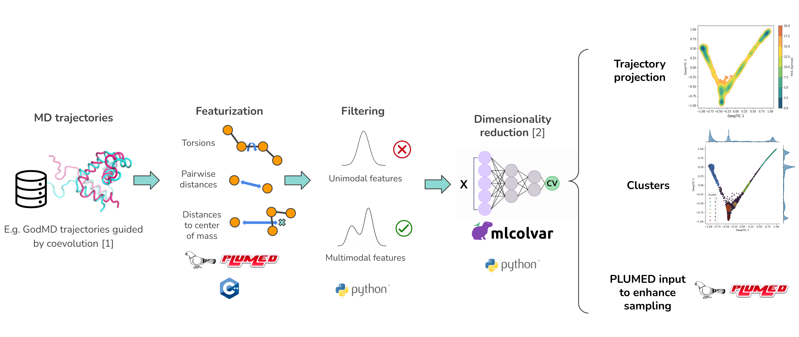

Deep Cartograph
===============


Deep cartograph is a package to analyze and enhance MD simulations.

---

Deep cartograph can be used to train different collective variables from simulation data. Either to analyze existing trajectories or to use them to enhance the sampling in subsequent simulations. It leverages PLUMED to compute the features and the [mlcolvar](https://github.com/luigibonati/mlcolvar.git) library to train the different collective variables [1](https://pubs.aip.org/aip/jcp/article-abstract/159/1/014801/2901354/A-unified-framework-for-machine-learning?redirectedFrom=fulltext).

Starting from a trajectory and topology files, Deep cartograph can be used to:

  1. Featurize the trajectory into a lower dimensional space invariant to rotations and translations.
  2. Filter the features.
  3. Compute and train different collective variables (CVs) using the filtered features.
  4. Project and cluster the trajectory in the CV space.
  5. Produce a PLUMED input file to enhance the sampling.



---


### Project structure

- **deep_cartograph**: contains all the tools and modules that form part of the deep_cartograph package.
- **examples**: contains examples of how to use the package.

## Installation

Using conda, create the deep cartograph environment from the `environment.yml` file.

```
git clone https://github.com/NBDsoftware/deep_cartograph.git
cd deep_cartograph
conda env create -f environment_detailed.yml
```

The `environment_detailed.yml` file has been produced using `conda env export --no-builds -f environment_detailed.yml` and should be cross-platform compatible. 
Otherwise try to create the environment from `environment_production.yml`.

Activate the environment and install the deep cartograph package itself.

```
cd deep_cartograph
pip install .
```

## Usage

The main workflow can be used calling `deep_carto` within the environment:

```
usage: Deep Cartograph [-h] -conf CONFIGURATION_PATH -traj_data TRAJECTORY_DATA -top_data TOPOLOGY_DATA [-ref_traj_data REF_TRAJECTORY_DATA] [-ref_topology_data REF_TOPOLOGY_DATA] [-label_reference]
                       [-restart] [-dim DIMENSION] [-cvs CVS [CVS ...]] [-out OUTPUT_FOLDER] [-v]

Map trajectories onto Collective Variables.

options:
  -h, --help            show this help message and exit
  -conf CONFIGURATION_PATH, -configuration CONFIGURATION_PATH
                        Path to configuration file (.yml)
  -traj_data TRAJECTORY_DATA
                        Path to trajectory or folder with trajectories to compute the CVs.
  -top_data TOPOLOGY_DATA
                        Path to topology or folder with topology files for the trajectories. If a folder is provided, each topology should have the same name as the corresponding trajectory in
                        -traj_data.
  -ref_traj_data REF_TRAJECTORY_DATA
                        Path to reference trajectory or folder with reference trajectories. To project alongside the main trajectory data but not used to compute the CVs.
  -ref_topology_data REF_TOPOLOGY_DATA
                        Path to reference topology or folder with reference topologies. If a folder is provided, each topology should have the same name as the corresponding reference trajectory in
                        -ref_traj_data.
  -label_reference      Use labels for reference data (names of the files in the reference folder). This option is not recommended if there are many samples in the reference data.
  -restart              Set to restart the workflow from the last finished step. Erase those step folders that you want to repeat.
  -dim DIMENSION, -dimension DIMENSION
                        Dimension of the CV to train or compute, overwrites the configuration input YML.
  -cvs CVS [CVS ...]    Collective variables to train or compute (pca, ae, tica, htica, deep_tica), overwrites the configuration input YML.
  -out OUTPUT_FOLDER, -output OUTPUT_FOLDER
                        Path to the output folder
  -v, -verbose          Set the logging level to DEBUG
```

An example for the YAML configuration file can be found here `deep_cartograph/default_config.yml`.

**PLUMED interface**: the resulting Deep Learning CVs can be deployed for enhancing sampling with the [PLUMED](https://www.plumed.org/) package via the [pytorch](https://www.plumed.org/doc-master/user-doc/html/_p_y_t_o_r_c_h__m_o_d_e_l.html>`_) interface, available since version 2.9. 

## FAQ

**Error in LatticeReduction.cpp when using a trajectory from AMBER**

```
(tools/LatticeReduction.cpp:42) static void PLMD::LatticeReduction::sort(PLMD::Vector*)
+++ assertion failed: m[1]<=m[2]*onePlusEpsilon
```

This is related to how PLUMED reads the lattice vector information from the input files. Might be a problem specific to AMBER, see [discussion](https://groups.google.com/g/plumed-users/c/k6QoUu5LGoE/m/uzt4VGooCAAJ?utm_medium=email&utm_source=footer). Try to change the PLUMED version or convert the trajectory to a different format.
